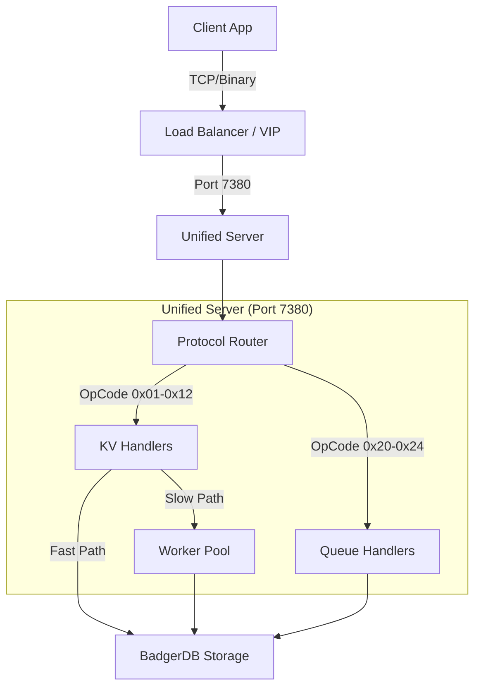

# 🌊 Flin End-to-End Data Flow

This document explains how data flows through the Flin system, from the client application to the storage engine.

## 🏗️ High-Level Architecture

## 🔄 Request Lifecycle

### 1. Client Connection
- The client connects to the unified server on port **7380**.
- A single TCP connection is used for both KV and Queue operations.
- The client uses the **Flin Binary Protocol** for maximum performance.

### 2. Protocol Routing (`server.go`)
- The server reads the first byte of the request (OpCode).
- **Auto-Detection**:
  - `0x01` - `0x12`: Routed to **KV Handlers**.
  - `0x20` - `0x24`: Routed to **Queue Handlers**.
  - `ASCII`: Routed to **Text Protocol Handler** (legacy/CLI support).

### 3. Handler Execution

#### KV Operations (`kv_handlers.go`)
- **Fast Path**: Simple operations (GET, SET) are executed immediately in the I/O goroutine.
- **Slow Path**: Complex operations (MSET, MGET) or those blocking for too long are dispatched to a **Worker Pool** (256 workers) to prevent blocking the event loop.

#### Queue Operations (`queue_handlers.go`)
- **Push**: Appends item to the tail of the queue in BadgerDB.
- **Pop**: Retrieves and removes item from the head of the queue.
- **Atomic Metadata**: Uses BadgerDB transactions to ensure queue head/tail pointers are always consistent, even under high concurrency.

### 4. Storage Layer (`internal/storage`)
- **Engine**: BadgerDB (LSM Tree based).
- **KV Data**: Stored as standard key-value pairs.
- **Queue Data**: Stored with lexicographical keys (`queue:data:<name>:<sequence_id>`) to ensure ordered retrieval.

## 🚀 Performance Optimization

| Component | Optimization Strategy |
|-----------|----------------------|
| **Network** | TCP NoDelay, KeepAlive, 4MB Buffers |
| **Protocol** | Binary encoding (zero-allocation parsing) |
| **Concurrency** | Hybrid Threading (IO Loop + Worker Pool) |
| **Storage** | Async writes, 1GB Block Cache, LSM Tree |

## 📊 Data Flow Example: Queue Push

1. **Client**: Encodes `OP_Q_PUSH | len(name) | name | len(val) | val`.
2. **Server**: Reads header, identifies `OP_Q_PUSH`.
3. **Router**: Calls `processBinaryQPush`.
4. **Handler**:
   - Starts BadgerDB transaction.
   - Reads Queue Metadata (Head/Tail).
   - Writes Value to `queue:data:name:Tail`.
   - Updates Metadata (Tail++).
   - Commits Transaction.
5. **Server**: Sends `OP_OK` response.
6. **Client**: Receives success.
